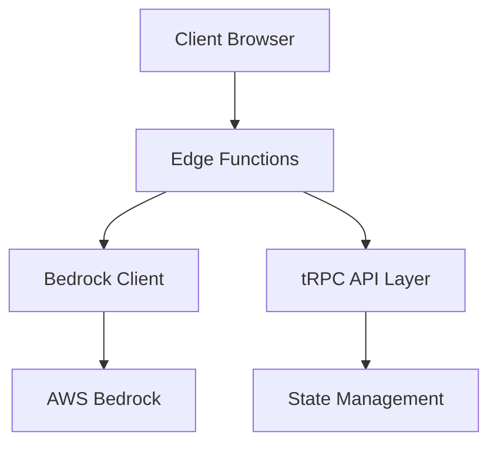
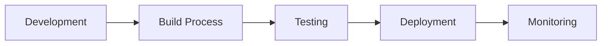

# Architecture Overview

## System Architecture

The AWS Next Edge Bedrock REPL is built with a modern edge-first architecture, optimizing for global low latency and real-time interactions.



## Key Components

### Frontend Layer
- **Next.js 14 App Router**: Core framework providing server-side and client-side rendering
- **React Components**: Modular UI components built with TypeScript
- **Monaco Editor**: Code editor with TypeScript support
- **TanStack Query**: Data synchronization and caching
- **shadcn/ui**: UI component library
- **Tailwind CSS**: Utility-first styling

### API Layer
- **tRPC**: End-to-end type-safe API
- **Edge Functions**: Serverless computation at the edge
- **WebSocket**: Real-time updates and streaming

### AWS Integration
- **Bedrock Client**: AWS Bedrock API integration
- **IAM**: Security and access management
- **Edge Optimization**: Global low-latency deployment

### State Management
- **TanStack Query**: Client-side state management
- **Server Components**: Server-side state handling
- **Edge Caching**: Response caching at the edge

## Data Flow

1. **Code Execution Flow**
   ```mermaid
   sequenceDiagram
       participant User
       participant Editor
       participant Edge
       participant Bedrock
       
       User->>Editor: Write Code
       Editor->>Edge: Submit Code
       Edge->>Bedrock: Execute
       Bedrock->>Edge: Return Result
       Edge->>Editor: Update UI
       Editor->>User: Display Result
   ```

2. **State Management Flow**
   ```mermaid
   sequenceDiagram
       participant Client
       participant Edge
       participant State
       
       Client->>Edge: Request
       Edge->>State: Check Cache
       State->>Edge: Return Cache/Update
       Edge->>Client: Response
   ```

## Security Architecture

- **Edge Security**: Request validation at edge
- **AWS IAM**: Role-based access control
- **API Security**: Type-safe endpoints
- **CORS**: Configured security headers
- **Rate Limiting**: Request throttling

## Performance Optimization

1. **Edge Caching**
   - Response caching at edge locations
   - Intelligent cache invalidation
   - Cache-control headers

2. **Code Optimization**
   - Bundle size optimization
   - Code splitting
   - Lazy loading
   - Tree shaking

3. **Network Optimization**
   - Edge function deployment
   - Global CDN
   - Response compression

## Development Architecture



1. **Development Environment**
   - Local development server
   - Hot module replacement
   - TypeScript compilation
   - ESLint + Prettier

2. **Build Process**
   - Next.js production build
   - Asset optimization
   - Environment configuration

3. **Testing Infrastructure**
   - Unit tests
   - Integration tests
   - E2E tests
   - Type checking

4. **Deployment Pipeline**
   - CI/CD workflow
   - Edge function deployment
   - AWS configuration
   - Environment validation

## Monitoring and Logging

- **Performance Monitoring**
  - Edge function metrics
  - API latency tracking
  - Error reporting
  - Usage analytics

- **Logging System**
  - Structured logging
  - Error tracking
  - Audit trails
  - Debug information

## Future Considerations

1. **Scalability**
   - Horizontal scaling
   - Load balancing
   - Database integration
   - Caching strategies

2. **Feature Expansion**
   - Additional model support
   - Collaborative features
   - Custom runtime environments
   - Advanced debugging tools

3. **Integration Options**
   - CI/CD pipeline integration
   - IDE plugins
   - API extensions
   - Custom model fine-tuning
